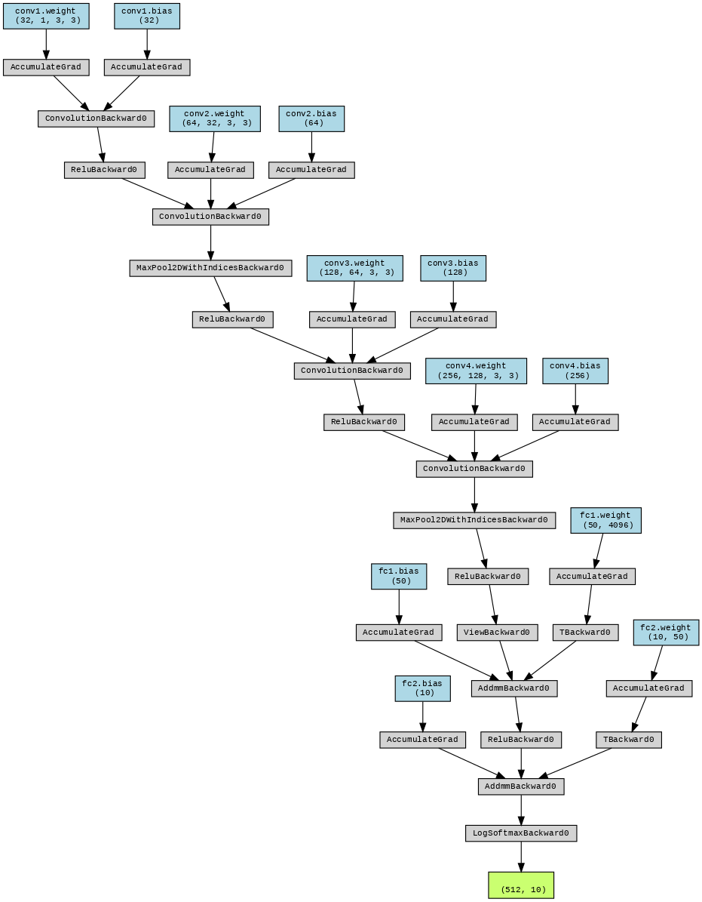
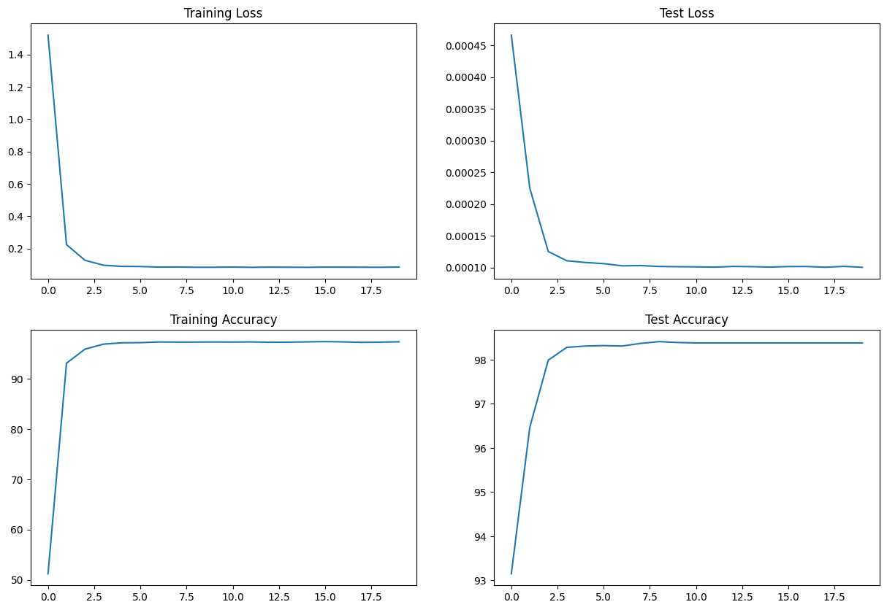

# Train Mnist Model

The repository includes code for training data from MNIST dataset. The code has been modularized for better readability and reusability in other assignments. 
My notebook for S% is shared at [S5.ipynb](./S5.ipynb)

### To Install Requirements

    pip install -r requirements.txt

## Info of the Network

The architecture of the Model Network is as follows:

 


```
----------------------------------------------------------------
        Layer (type)               Output Shape         Param #
================================================================
            Conv2d-1           [-1, 32, 26, 26]             320
            Conv2d-2           [-1, 64, 24, 24]          18,496
            Conv2d-3          [-1, 128, 10, 10]          73,856
            Conv2d-4            [-1, 256, 8, 8]         295,168
            Linear-5                   [-1, 50]         204,850
            Linear-6                   [-1, 10]             510
================================================================
Total params: 593,200
Trainable params: 593,200
Non-trainable params: 0
----------------------------------------------------------------
```
## Train Information 

Treained the network using MNIST data for 20 epochs and able to achinve train accuracy of 97.39% and test acuracy of 98.55%

```
Adjusting learning rate of group 0 to 1.0000e-02.
Epoch 1
Train: Loss=1.1892 Batch_id=117 Accuracy=36.93: 100%|██████████| 118/118 [00:32<00:00,  3.67it/s]
Test set: Average loss: 0.0016, Accuracy: 7756/10000 (77.56%)

Adjusting learning rate of group 0 to 1.0000e-02.
Epoch 2
Train: Loss=0.2662 Batch_id=117 Accuracy=90.88: 100%|██████████| 118/118 [00:26<00:00,  4.45it/s]
Test set: Average loss: 0.0002, Accuracy: 9717/10000 (97.17%)

Adjusting learning rate of group 0 to 1.0000e-02.
Epoch 3
Train: Loss=0.1634 Batch_id=117 Accuracy=96.09: 100%|██████████| 118/118 [00:24<00:00,  4.78it/s]
Test set: Average loss: 0.0001, Accuracy: 9788/10000 (97.88%)

Adjusting learning rate of group 0 to 1.0000e-03.
Epoch 4
Train: Loss=0.0787 Batch_id=117 Accuracy=97.01: 100%|██████████| 118/118 [00:26<00:00,  4.53it/s]
Test set: Average loss: 0.0001, Accuracy: 9843/10000 (98.43%)

Adjusting learning rate of group 0 to 1.0000e-03.
Epoch 5
Train: Loss=0.0784 Batch_id=117 Accuracy=97.15: 100%|██████████| 118/118 [00:24<00:00,  4.73it/s]
Test set: Average loss: 0.0001, Accuracy: 9852/10000 (98.52%)

Adjusting learning rate of group 0 to 1.0000e-03.
Epoch 6
Train: Loss=0.1109 Batch_id=117 Accuracy=97.27: 100%|██████████| 118/118 [00:25<00:00,  4.68it/s]
Test set: Average loss: 0.0001, Accuracy: 9850/10000 (98.50%)

Adjusting learning rate of group 0 to 1.0000e-04.
Epoch 7
Train: Loss=0.0244 Batch_id=117 Accuracy=97.37: 100%|██████████| 118/118 [00:24<00:00,  4.73it/s]
Test set: Average loss: 0.0001, Accuracy: 9852/10000 (98.52%)

Adjusting learning rate of group 0 to 1.0000e-04.
Epoch 8
Train: Loss=0.0418 Batch_id=117 Accuracy=97.45: 100%|██████████| 118/118 [00:24<00:00,  4.78it/s]
Test set: Average loss: 0.0001, Accuracy: 9852/10000 (98.52%)

Adjusting learning rate of group 0 to 1.0000e-04.
Epoch 9
Train: Loss=0.1105 Batch_id=117 Accuracy=97.45: 100%|██████████| 118/118 [00:25<00:00,  4.68it/s]
Test set: Average loss: 0.0001, Accuracy: 9854/10000 (98.54%)

Adjusting learning rate of group 0 to 1.0000e-05.
Epoch 10
Train: Loss=0.0705 Batch_id=117 Accuracy=97.42: 100%|██████████| 118/118 [00:26<00:00,  4.49it/s]
Test set: Average loss: 0.0001, Accuracy: 9854/10000 (98.54%)

Adjusting learning rate of group 0 to 1.0000e-05.
Epoch 11
Train: Loss=0.0980 Batch_id=117 Accuracy=97.42: 100%|██████████| 118/118 [00:24<00:00,  4.86it/s]
Test set: Average loss: 0.0001, Accuracy: 9855/10000 (98.55%)

Adjusting learning rate of group 0 to 1.0000e-05.
Epoch 12
Train: Loss=0.0842 Batch_id=117 Accuracy=97.37: 100%|██████████| 118/118 [00:24<00:00,  4.77it/s]
Test set: Average loss: 0.0001, Accuracy: 9855/10000 (98.55%)

Adjusting learning rate of group 0 to 1.0000e-06.
Epoch 13
Train: Loss=0.0577 Batch_id=117 Accuracy=97.53: 100%|██████████| 118/118 [00:24<00:00,  4.73it/s]
Test set: Average loss: 0.0001, Accuracy: 9855/10000 (98.55%)

Adjusting learning rate of group 0 to 1.0000e-06.
Epoch 14
Train: Loss=0.0414 Batch_id=117 Accuracy=97.50: 100%|██████████| 118/118 [00:24<00:00,  4.79it/s]
Test set: Average loss: 0.0001, Accuracy: 9855/10000 (98.55%)

Adjusting learning rate of group 0 to 1.0000e-06.
Epoch 15
Train: Loss=0.0125 Batch_id=117 Accuracy=97.41: 100%|██████████| 118/118 [00:24<00:00,  4.76it/s]
Test set: Average loss: 0.0001, Accuracy: 9855/10000 (98.55%)

Adjusting learning rate of group 0 to 1.0000e-07.
Epoch 16
Train: Loss=0.0465 Batch_id=117 Accuracy=97.43: 100%|██████████| 118/118 [00:24<00:00,  4.80it/s]
Test set: Average loss: 0.0001, Accuracy: 9855/10000 (98.55%)

Adjusting learning rate of group 0 to 1.0000e-07.
Epoch 17
Train: Loss=0.0298 Batch_id=117 Accuracy=97.47: 100%|██████████| 118/118 [00:24<00:00,  4.78it/s]
Test set: Average loss: 0.0001, Accuracy: 9855/10000 (98.55%)

Adjusting learning rate of group 0 to 1.0000e-07.
Epoch 18
Train: Loss=0.0880 Batch_id=117 Accuracy=97.42: 100%|██████████| 118/118 [00:25<00:00,  4.55it/s]
Test set: Average loss: 0.0001, Accuracy: 9855/10000 (98.55%)

Adjusting learning rate of group 0 to 1.0000e-08.
Epoch 19
Train: Loss=0.0493 Batch_id=117 Accuracy=97.40: 100%|██████████| 118/118 [00:24<00:00,  4.88it/s]
Test set: Average loss: 0.0001, Accuracy: 9855/10000 (98.55%)

Adjusting learning rate of group 0 to 1.0000e-08.
Epoch 20
Train: Loss=0.0311 Batch_id=117 Accuracy=97.39: 100%|██████████| 118/118 [00:24<00:00,  4.86it/s]
Test set: Average loss: 0.0001, Accuracy: 9855/10000 (98.55%)

Adjusting learning rate of group 0 to 1.0000e-08.

```

Following is graph for training outcomes


