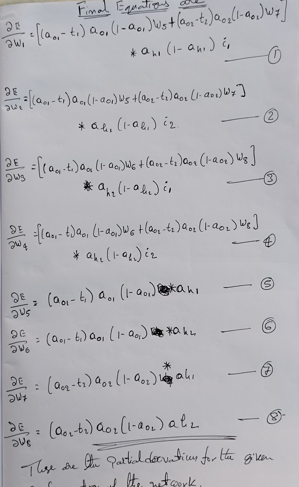
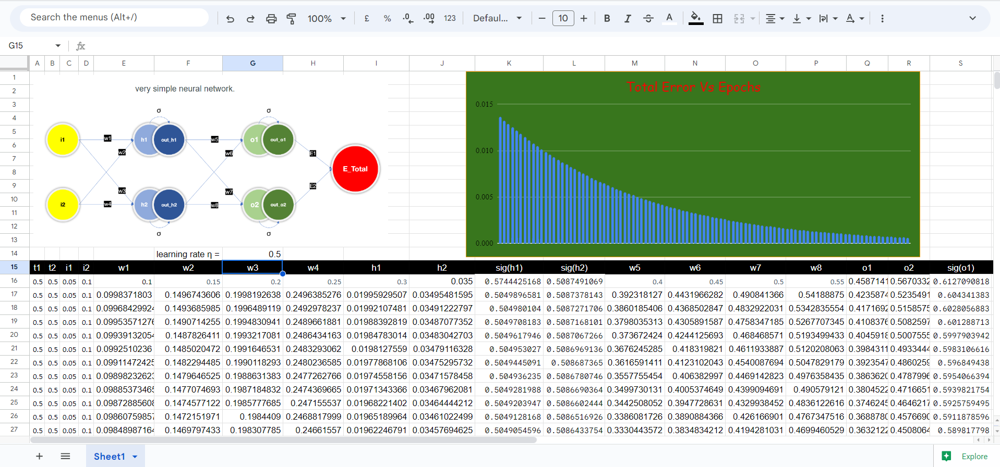

# Backpropagation on a Fully Connected Neural Network

This repository contains documentation and resources for understanding the process of backpropagation on a simple fully connected neural network. In addition, an Excel sheet is provided that demonstrates the manual calculation of backward propagation.

## Excel Sheet
The attached Excel sheet serves as a visual aid to understand the manual calculations involved in backpropagation. It showcases the step-by-step calculations of gradients and the updates made to the network's parameters based on these gradients.

The Excel sheet can be used as a reference and learning tool to deepen your understanding of the backpropagation algorithm.

[Sheet](./BackPropagation.xlsx)

## About the Network:

### Layers:
*  Input Layer(s)  - 1 No.
*  Hidden Layer(s) - 1 No.
*  Output Layer(s) - 1 No.

#### Neurons in the Layers:
   * Input Layer  with 2 neurons (i1 & i2)

   * One hidden layer with 2 neurons (h1 & h2). Activations on h1 & h2 are a_h1 & a_h2 respectively. 

   * One output layer with 2 neurons (o1 & o2). Activations on o1, o2 are a_o1 & a_o2 respectively. 

   * E1, E2 -> Error calculated between target values and outputs. Etotal = E1 + E2 
    
   * Weights: w1, w2, w3, w4, w5, w6, w7, w8 -> Weights of the Neural Network.

   * For simplicity, biases are not included in the model.

## Derivations 
   The chain rule serves as a fundamental tool in the backpropagation algorithm, enabling efficient and effective updates to the network's weights based on the calculated gradients.
   
   By leveraging the chain rule, we gain a deeper understanding of the impact of each weight on the network's performance and can fine-tune the weights to optimize the overall learning process.

## Screenshot of xlsx

