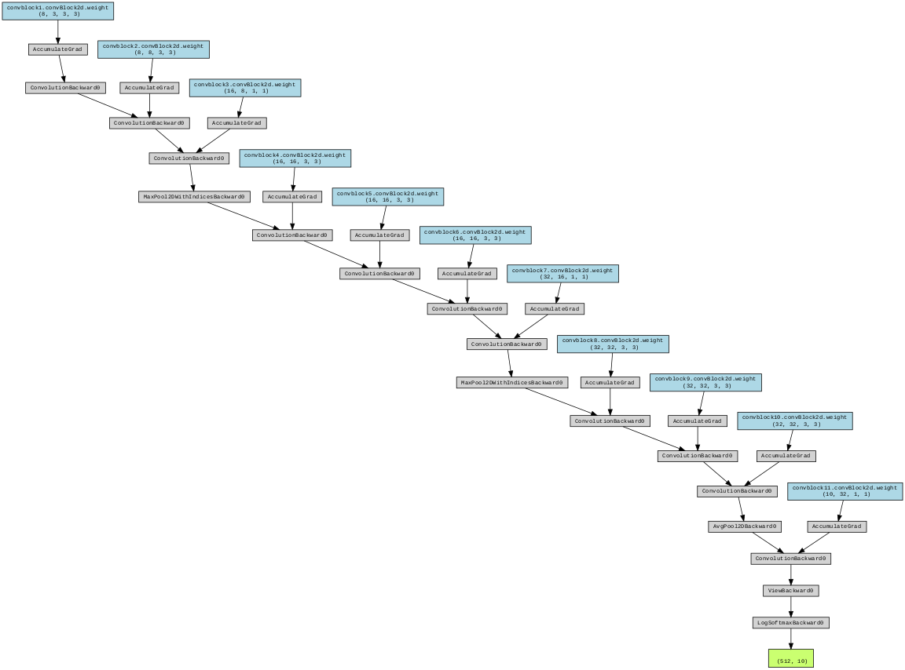

# Train Mnist Model

The repository includes code for training data from MNIST dataset. The code has been modularized for better readability and reusability in other assignments. 
My notebook for S% is shared at [S5.ipynb](./S5.ipynb)

### To Install Requirements

    pip install -r requirements.txt

## Info of the Network

The architecture of the Model Network is as follows:

 


```
----------------------------------------------------------------
        Layer (type)               Output Shape         Param #
================================================================
            Conv2d-1           [-1, 32, 26, 26]             320
            Conv2d-2           [-1, 64, 24, 24]          18,496
            Conv2d-3          [-1, 128, 10, 10]          73,856
            Conv2d-4            [-1, 256, 8, 8]         295,168
            Linear-5                   [-1, 50]         204,850
            Linear-6                   [-1, 10]             510
================================================================
Total params: 593,200
Trainable params: 593,200
Non-trainable params: 0
----------------------------------------------------------------
```
## Train Information 

Treained the network using MNIST data for 20 epochs and able to achinve train accuracy of 97.39% and test acuracy of 98.55%

```
Adjusting learning rate of group 0 to 1.0000e-02.
Epoch 1
Train: Loss=0.3568 Batch_id=117 Accuracy=55.20: 100%|██████████| 118/118 [00:29<00:00,  4.07it/s]
Test set: Average loss: 0.2268, Accuracy: 9343/10000 (93.43%)

Adjusting learning rate of group 0 to 1.0000e-02.
Epoch 2
Train: Loss=0.1749 Batch_id=117 Accuracy=93.88: 100%|██████████| 118/118 [00:21<00:00,  5.52it/s]
Test set: Average loss: 0.1040, Accuracy: 9668/10000 (96.68%)

Adjusting learning rate of group 0 to 1.0000e-02.
Epoch 3
Train: Loss=0.0485 Batch_id=117 Accuracy=96.18: 100%|██████████| 118/118 [00:22<00:00,  5.36it/s]
Test set: Average loss: 0.0614, Accuracy: 9800/10000 (98.00%)

Adjusting learning rate of group 0 to 1.0000e-02.
Epoch 4
Train: Loss=0.0827 Batch_id=117 Accuracy=97.13: 100%|██████████| 118/118 [00:22<00:00,  5.26it/s]
Test set: Average loss: 0.0558, Accuracy: 9831/10000 (98.31%)

Adjusting learning rate of group 0 to 1.0000e-02.
Epoch 5
Train: Loss=0.0828 Batch_id=117 Accuracy=97.54: 100%|██████████| 118/118 [00:23<00:00,  4.97it/s]
Test set: Average loss: 0.0419, Accuracy: 9869/10000 (98.69%)

Adjusting learning rate of group 0 to 1.0000e-02.
Epoch 6
Train: Loss=0.0535 Batch_id=117 Accuracy=97.86: 100%|██████████| 118/118 [00:23<00:00,  5.10it/s]
Test set: Average loss: 0.0384, Accuracy: 9876/10000 (98.76%)

Adjusting learning rate of group 0 to 1.0000e-02.
Epoch 7
Train: Loss=0.0163 Batch_id=117 Accuracy=98.04: 100%|██████████| 118/118 [00:22<00:00,  5.19it/s]
Test set: Average loss: 0.0370, Accuracy: 9881/10000 (98.81%)

Adjusting learning rate of group 0 to 1.0000e-02.
Epoch 8
Train: Loss=0.0363 Batch_id=117 Accuracy=98.23: 100%|██████████| 118/118 [00:22<00:00,  5.23it/s]
Test set: Average loss: 0.0315, Accuracy: 9897/10000 (98.97%)

Adjusting learning rate of group 0 to 1.0000e-02.
Epoch 9
Train: Loss=0.1077 Batch_id=117 Accuracy=98.44: 100%|██████████| 118/118 [00:23<00:00,  4.93it/s]
Test set: Average loss: 0.0302, Accuracy: 9904/10000 (99.04%)

Adjusting learning rate of group 0 to 1.0000e-02.
Epoch 10
Train: Loss=0.0340 Batch_id=117 Accuracy=98.40: 100%|██████████| 118/118 [00:22<00:00,  5.17it/s]
Test set: Average loss: 0.0326, Accuracy: 9896/10000 (98.96%)

Adjusting learning rate of group 0 to 1.0000e-02.
Epoch 11
Train: Loss=0.0854 Batch_id=117 Accuracy=98.57: 100%|██████████| 118/118 [00:22<00:00,  5.16it/s]
Test set: Average loss: 0.0304, Accuracy: 9897/10000 (98.97%)

Adjusting learning rate of group 0 to 1.0000e-02.
Epoch 12
Train: Loss=0.0545 Batch_id=117 Accuracy=98.60: 100%|██████████| 118/118 [00:22<00:00,  5.14it/s]
Test set: Average loss: 0.0293, Accuracy: 9904/10000 (99.04%)

Adjusting learning rate of group 0 to 1.0000e-02.
Epoch 13
Train: Loss=0.0968 Batch_id=117 Accuracy=98.69: 100%|██████████| 118/118 [00:22<00:00,  5.21it/s]
Test set: Average loss: 0.0259, Accuracy: 9909/10000 (99.09%)

Adjusting learning rate of group 0 to 1.0000e-02.
Epoch 14
Train: Loss=0.0143 Batch_id=117 Accuracy=98.74: 100%|██████████| 118/118 [00:23<00:00,  5.10it/s]
Test set: Average loss: 0.0268, Accuracy: 9908/10000 (99.08%)

Adjusting learning rate of group 0 to 1.0000e-02.
Epoch 15
Train: Loss=0.0314 Batch_id=117 Accuracy=98.86: 100%|██████████| 118/118 [00:22<00:00,  5.17it/s]
Test set: Average loss: 0.0240, Accuracy: 9917/10000 (99.17%)

Adjusting learning rate of group 0 to 1.0000e-03.
Epoch 16
Train: Loss=0.0187 Batch_id=117 Accuracy=99.14: 100%|██████████| 118/118 [00:22<00:00,  5.24it/s]
Test set: Average loss: 0.0211, Accuracy: 9928/10000 (99.28%)

Adjusting learning rate of group 0 to 1.0000e-03.
Epoch 17
Train: Loss=0.0893 Batch_id=117 Accuracy=99.16: 100%|██████████| 118/118 [00:22<00:00,  5.24it/s]
Test set: Average loss: 0.0207, Accuracy: 9929/10000 (99.29%)

Adjusting learning rate of group 0 to 1.0000e-03.
Epoch 18
Train: Loss=0.0015 Batch_id=117 Accuracy=99.17: 100%|██████████| 118/118 [00:22<00:00,  5.24it/s]
Test set: Average loss: 0.0206, Accuracy: 9928/10000 (99.28%)

Adjusting learning rate of group 0 to 1.0000e-03.
Epoch 19
Train: Loss=0.0846 Batch_id=117 Accuracy=99.22: 100%|██████████| 118/118 [00:23<00:00,  5.02it/s]
Test set: Average loss: 0.0205, Accuracy: 9931/10000 (99.31%)

Adjusting learning rate of group 0 to 1.0000e-03.
Epoch 20
Train: Loss=0.0048 Batch_id=117 Accuracy=99.20: 100%|██████████| 118/118 [00:22<00:00,  5.21it/s]
Test set: Average loss: 0.0209, Accuracy: 9927/10000 (99.27%)

Adjusting learning rate of group 0 to 1.0000e-03.

```

Following is graph for training outcomes


