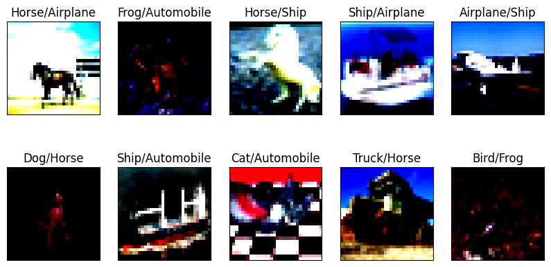

# The focus of this assignment revolves around three types of normalization techniques

The network parameters are trained using three different normalizations, namely `BatchNormalization`, `GroupNormalization`, and `LayerNormalization`.

For this assignment, the training and testing dataset is changed to CIFAR-10.

## Outputs of the three normalization techniques.

The following will be shown per technique:
1. Model's Network Architecture
2. Model's Summary And Parameters
3. Model's Performance
4. Training Logs
5. Confusion Metrics
6. Incorrect Predictions

## Over all comparison between the three techniques.


### Batch Normalization

<b>Network Architecture</b>


<b>Parameters And Model Summary</b>

```
----------------------------------------------------------------
Device: cpu
Batch Size: 512
Normalization: bn
Dropout: 0.1
Momentum: 0.0
Skip Connection: True
----------------------------------------------------------------
        Layer (type)               Output Shape         Param #
================================================================
            Conv2d-1            [-1, 4, 32, 32]             108
              ReLU-2            [-1, 4, 32, 32]               0
       BatchNorm2d-3            [-1, 4, 32, 32]               8
           Dropout-4            [-1, 4, 32, 32]               0
            Conv2d-5            [-1, 8, 32, 32]             288
              ReLU-6            [-1, 8, 32, 32]               0
       BatchNorm2d-7            [-1, 8, 32, 32]              16
           Dropout-8            [-1, 8, 32, 32]               0
            Conv2d-9            [-1, 8, 32, 32]             576
             ReLU-10            [-1, 8, 32, 32]               0
      BatchNorm2d-11            [-1, 8, 32, 32]              16
          Dropout-12            [-1, 8, 32, 32]               0
           Conv2d-13            [-1, 8, 32, 32]              64
        MaxPool2d-14            [-1, 8, 16, 16]               0
           Conv2d-15           [-1, 16, 16, 16]           1,152
             ReLU-16           [-1, 16, 16, 16]               0
      BatchNorm2d-17           [-1, 16, 16, 16]              32
          Dropout-18           [-1, 16, 16, 16]               0
           Conv2d-19           [-1, 32, 16, 16]           4,608
             ReLU-20           [-1, 32, 16, 16]               0
      BatchNorm2d-21           [-1, 32, 16, 16]              64
          Dropout-22           [-1, 32, 16, 16]               0
           Conv2d-23           [-1, 32, 16, 16]           9,216
             ReLU-24           [-1, 32, 16, 16]               0
      BatchNorm2d-25           [-1, 32, 16, 16]              64
          Dropout-26           [-1, 32, 16, 16]               0
           Conv2d-27           [-1, 16, 16, 16]             512
        MaxPool2d-28             [-1, 16, 8, 8]               0
           Conv2d-29             [-1, 32, 8, 8]           4,608
             ReLU-30             [-1, 32, 8, 8]               0
      BatchNorm2d-31             [-1, 32, 8, 8]              64
          Dropout-32             [-1, 32, 8, 8]               0
           Conv2d-33             [-1, 64, 8, 8]          18,432
             ReLU-34             [-1, 64, 8, 8]               0
      BatchNorm2d-35             [-1, 64, 8, 8]             128
          Dropout-36             [-1, 64, 8, 8]               0
           Conv2d-37             [-1, 32, 8, 8]           2,048
        AvgPool2d-38             [-1, 32, 1, 1]               0
           Conv2d-39             [-1, 10, 1, 1]             320
================================================================
Total params: 42,324
Trainable params: 42,324
Non-trainable params: 0
----------------------------------------------------------------
Input size (MB): 0.01
Forward/backward pass size (MB): 1.57
Params size (MB): 0.16
Estimated Total Size (MB): 1.74
----------------------------------------------------------------
Adjusting learning rate of group 0 to 1.0000e-02.
Device: cpu
Epochs: 20
Lr: 0.01
Batch Size: 512
Dropout: 0.1
Momentum: 0.0
----------------------------------------------------------------
```

<b>Model Performance</b>


<b>Training Logs</b>

```
Using Device: cpu
Epochs: 20
Lr: 0.01
Batch Size: 512
Dropout: True
Dropout Ratio: 0.01
Momentum: 0.0
Use L1: False
----------------------------------------------------------------
Epoch 1
Train: Loss=2.0926 Batch_id=97 Accuracy=18.47: 100%|██████████| 98/98 [02:00<00:00,  1.23s/it]
Test set: Average loss: 2.1695, Accuracy: 1754/10000 (17.54%)

Adjusting learning rate of group 0 to 1.0000e-02.
Epoch 2
Train: Loss=1.9820 Batch_id=97 Accuracy=23.81: 100%|██████████| 98/98 [01:58<00:00,  1.21s/it]
Test set: Average loss: 2.1779, Accuracy: 1699/10000 (16.99%)

Adjusting learning rate of group 0 to 1.0000e-02.
Epoch 3
Train: Loss=1.8565 Batch_id=97 Accuracy=27.03: 100%|██████████| 98/98 [01:57<00:00,  1.20s/it]
Test set: Average loss: 2.0697, Accuracy: 1965/10000 (19.65%)

Adjusting learning rate of group 0 to 1.0000e-02.
Epoch 4
Train: Loss=1.8262 Batch_id=97 Accuracy=29.75: 100%|██████████| 98/98 [01:59<00:00,  1.22s/it]
Test set: Average loss: 2.0550, Accuracy: 2205/10000 (22.05%)

Adjusting learning rate of group 0 to 1.0000e-02.
Epoch 5
Train: Loss=1.8434 Batch_id=97 Accuracy=31.40: 100%|██████████| 98/98 [01:58<00:00,  1.21s/it]
Test set: Average loss: 2.0085, Accuracy: 2421/10000 (24.21%)

Adjusting learning rate of group 0 to 1.0000e-02.
Epoch 6
Train: Loss=1.8108 Batch_id=97 Accuracy=32.45: 100%|██████████| 98/98 [01:58<00:00,  1.21s/it]
Test set: Average loss: 1.9647, Accuracy: 2584/10000 (25.84%)

Adjusting learning rate of group 0 to 1.0000e-02.
Epoch 7
Train: Loss=1.7405 Batch_id=97 Accuracy=32.73: 100%|██████████| 98/98 [01:59<00:00,  1.22s/it]
Test set: Average loss: 2.0196, Accuracy: 2499/10000 (24.99%)

Adjusting learning rate of group 0 to 1.0000e-02.
Epoch 8
Train: Loss=1.7802 Batch_id=97 Accuracy=33.03: 100%|██████████| 98/98 [01:59<00:00,  1.22s/it]
Test set: Average loss: 1.9077, Accuracy: 2801/10000 (28.01%)

Adjusting learning rate of group 0 to 1.0000e-02.
Epoch 9
Train: Loss=1.6819 Batch_id=97 Accuracy=34.02: 100%|██████████| 98/98 [01:59<00:00,  1.22s/it]
Test set: Average loss: 1.8964, Accuracy: 2861/10000 (28.61%)

Adjusting learning rate of group 0 to 1.0000e-02.
Epoch 10
Train: Loss=1.8268 Batch_id=97 Accuracy=35.37: 100%|██████████| 98/98 [01:59<00:00,  1.22s/it]
Test set: Average loss: 1.8283, Accuracy: 3085/10000 (30.85%)

Adjusting learning rate of group 0 to 1.0000e-02.
Epoch 11
Train: Loss=1.7135 Batch_id=97 Accuracy=36.12: 100%|██████████| 98/98 [01:59<00:00,  1.21s/it]
Test set: Average loss: 1.7669, Accuracy: 3339/10000 (33.39%)

Adjusting learning rate of group 0 to 1.0000e-02.
Epoch 12
Train: Loss=1.7044 Batch_id=97 Accuracy=36.83: 100%|██████████| 98/98 [01:59<00:00,  1.22s/it]
Test set: Average loss: 1.7777, Accuracy: 3468/10000 (34.68%)

Adjusting learning rate of group 0 to 1.0000e-02.
Epoch 13
Train: Loss=1.6579 Batch_id=97 Accuracy=37.67: 100%|██████████| 98/98 [01:59<00:00,  1.22s/it]
Test set: Average loss: 1.7173, Accuracy: 3691/10000 (36.91%)

Adjusting learning rate of group 0 to 1.0000e-02.
Epoch 14
Train: Loss=1.7049 Batch_id=97 Accuracy=38.20: 100%|██████████| 98/98 [01:59<00:00,  1.21s/it]
Test set: Average loss: 1.6863, Accuracy: 3833/10000 (38.33%)

Adjusting learning rate of group 0 to 1.0000e-02.
Epoch 15
Train: Loss=1.7452 Batch_id=97 Accuracy=38.69: 100%|██████████| 98/98 [01:59<00:00,  1.22s/it]
Test set: Average loss: 1.6928, Accuracy: 3856/10000 (38.56%)

Adjusting learning rate of group 0 to 1.0000e-03.
Epoch 16
Train: Loss=1.5730 Batch_id=97 Accuracy=39.06: 100%|██████████| 98/98 [01:58<00:00,  1.21s/it]
Test set: Average loss: 1.6703, Accuracy: 3881/10000 (38.81%)

Adjusting learning rate of group 0 to 1.0000e-03.
Epoch 17
Train: Loss=1.6071 Batch_id=97 Accuracy=39.45: 100%|██████████| 98/98 [01:58<00:00,  1.21s/it]
Test set: Average loss: 1.6841, Accuracy: 3881/10000 (38.81%)

Adjusting learning rate of group 0 to 1.0000e-03.
Epoch 18
Train: Loss=1.5831 Batch_id=97 Accuracy=39.21: 100%|██████████| 98/98 [01:59<00:00,  1.22s/it]
Test set: Average loss: 1.6721, Accuracy: 3892/10000 (38.92%)

Adjusting learning rate of group 0 to 1.0000e-03.
Epoch 19
Train: Loss=1.6278 Batch_id=97 Accuracy=39.15: 100%|██████████| 98/98 [01:59<00:00,  1.22s/it]
Test set: Average loss: 1.6719, Accuracy: 3898/10000 (38.98%)

Adjusting learning rate of group 0 to 1.0000e-03.
Epoch 20
Train: Loss=1.6760 Batch_id=97 Accuracy=39.68: 100%|██████████| 98/98 [01:59<00:00,  1.22s/it]
Test set: Average loss: 1.6685, Accuracy: 3897/10000 (38.97%)
-------------------------------------------------------------------------
```

<b>Incorrect Predictions</b>


<b>Confusion Matrix</b>


### Group Normalization

<b>Network Architecture</b>


<b>Parameters And Model Summary</b>

```
-------------------------------------------------------------------------
Device: cpu
Batch Size: 512
Normalization: gn
Dropout: 0.1
Momentum: 0.0
Skip Connection: True
----------------------------------------------------------------
        Layer (type)               Output Shape         Param #
================================================================
            Conv2d-1            [-1, 4, 32, 32]             108
              ReLU-2            [-1, 4, 32, 32]               0
         GroupNorm-3            [-1, 4, 32, 32]               8
           Dropout-4            [-1, 4, 32, 32]               0
            Conv2d-5            [-1, 8, 32, 32]             288
              ReLU-6            [-1, 8, 32, 32]               0
         GroupNorm-7            [-1, 8, 32, 32]              16
           Dropout-8            [-1, 8, 32, 32]               0
            Conv2d-9            [-1, 8, 32, 32]             576
             ReLU-10            [-1, 8, 32, 32]               0
        GroupNorm-11            [-1, 8, 32, 32]              16
          Dropout-12            [-1, 8, 32, 32]               0
           Conv2d-13            [-1, 8, 32, 32]              64
        MaxPool2d-14            [-1, 8, 16, 16]               0
           Conv2d-15           [-1, 16, 16, 16]           1,152
             ReLU-16           [-1, 16, 16, 16]               0
        GroupNorm-17           [-1, 16, 16, 16]              32
          Dropout-18           [-1, 16, 16, 16]               0
           Conv2d-19           [-1, 32, 16, 16]           4,608
             ReLU-20           [-1, 32, 16, 16]               0
        GroupNorm-21           [-1, 32, 16, 16]              64
          Dropout-22           [-1, 32, 16, 16]               0
           Conv2d-23           [-1, 32, 16, 16]           9,216
             ReLU-24           [-1, 32, 16, 16]               0
        GroupNorm-25           [-1, 32, 16, 16]              64
          Dropout-26           [-1, 32, 16, 16]               0
           Conv2d-27           [-1, 16, 16, 16]             512
        MaxPool2d-28             [-1, 16, 8, 8]               0
           Conv2d-29             [-1, 32, 8, 8]           4,608
             ReLU-30             [-1, 32, 8, 8]               0
        GroupNorm-31             [-1, 32, 8, 8]              64
          Dropout-32             [-1, 32, 8, 8]               0
           Conv2d-33             [-1, 64, 8, 8]          18,432
             ReLU-34             [-1, 64, 8, 8]               0
        GroupNorm-35             [-1, 64, 8, 8]             128
          Dropout-36             [-1, 64, 8, 8]               0
           Conv2d-37             [-1, 32, 8, 8]           2,048
        AvgPool2d-38             [-1, 32, 1, 1]               0
           Conv2d-39             [-1, 10, 1, 1]             320
================================================================
Total params: 42,324
Trainable params: 42,324
Non-trainable params: 0
----------------------------------------------------------------
Input size (MB): 0.01
Forward/backward pass size (MB): 1.57
Params size (MB): 0.16
Estimated Total Size (MB): 1.74
----------------------------------------------------------------
Adjusting learning rate of group 0 to 1.0000e-02.
Device: cpu
Epochs: 20
Lr: 0.01
Batch Size: 512
Dropout: 0.1
Momentum: 0.0
----------------------------------------------------------------
```

<b>Model Performance</b>


<b>Training Logs</b>

```
Using Device: cpu
Epochs: 20
Lr: 0.01
Batch Size: 512
Dropout: True
Dropout Ratio: 0.01
Momentum: 0.0
Use L1: False
------------------------------------------------------------------
Epoch 1
Train: Loss=2.2701 Batch_id=97 Accuracy=13.32: 100%|██████████| 98/98 [01:49<00:00,  1.12s/it]
Test set: Average loss: 2.2414, Accuracy: 1748/10000 (17.48%)

Adjusting learning rate of group 0 to 1.0000e-02.
Epoch 2
Train: Loss=2.1022 Batch_id=97 Accuracy=19.57: 100%|██████████| 98/98 [01:49<00:00,  1.12s/it]
Test set: Average loss: 2.0918, Accuracy: 2029/10000 (20.29%)

Adjusting learning rate of group 0 to 1.0000e-02.
Epoch 3
Train: Loss=2.0332 Batch_id=97 Accuracy=22.03: 100%|██████████| 98/98 [01:50<00:00,  1.12s/it]
Test set: Average loss: 2.0531, Accuracy: 2185/10000 (21.85%)

Adjusting learning rate of group 0 to 1.0000e-02.
Epoch 4
Train: Loss=1.9793 Batch_id=97 Accuracy=23.38: 100%|██████████| 98/98 [01:50<00:00,  1.12s/it]
Test set: Average loss: 2.0403, Accuracy: 2193/10000 (21.93%)

Adjusting learning rate of group 0 to 1.0000e-02.
Epoch 5
Train: Loss=2.0723 Batch_id=97 Accuracy=24.15: 100%|██████████| 98/98 [01:49<00:00,  1.12s/it]
Test set: Average loss: 1.9884, Accuracy: 2427/10000 (24.27%)

Adjusting learning rate of group 0 to 1.0000e-02.
Epoch 6
Train: Loss=1.9639 Batch_id=97 Accuracy=25.43: 100%|██████████| 98/98 [01:51<00:00,  1.13s/it]
Test set: Average loss: 1.9470, Accuracy: 2515/10000 (25.15%)

Adjusting learning rate of group 0 to 1.0000e-02.
Epoch 7
Train: Loss=1.9120 Batch_id=97 Accuracy=26.37: 100%|██████████| 98/98 [01:50<00:00,  1.13s/it]
Test set: Average loss: 1.9293, Accuracy: 2681/10000 (26.81%)

Adjusting learning rate of group 0 to 1.0000e-02.
Epoch 8
Train: Loss=1.9106 Batch_id=97 Accuracy=27.94: 100%|██████████| 98/98 [01:48<00:00,  1.11s/it]
Test set: Average loss: 1.8827, Accuracy: 2900/10000 (29.00%)

Adjusting learning rate of group 0 to 1.0000e-02.
Epoch 9
Train: Loss=1.9696 Batch_id=97 Accuracy=28.87: 100%|██████████| 98/98 [01:47<00:00,  1.10s/it]
Test set: Average loss: 1.8457, Accuracy: 3140/10000 (31.40%)

Adjusting learning rate of group 0 to 1.0000e-02.
Epoch 10
Train: Loss=1.8373 Batch_id=97 Accuracy=29.77: 100%|██████████| 98/98 [01:48<00:00,  1.11s/it]
Test set: Average loss: 1.8598, Accuracy: 3149/10000 (31.49%)

Adjusting learning rate of group 0 to 1.0000e-02.
Epoch 11
Train: Loss=1.9309 Batch_id=97 Accuracy=31.23: 100%|██████████| 98/98 [01:48<00:00,  1.10s/it]
Test set: Average loss: 1.8157, Accuracy: 3407/10000 (34.07%)

Adjusting learning rate of group 0 to 1.0000e-02.
Epoch 12
Train: Loss=1.8154 Batch_id=97 Accuracy=32.09: 100%|██████████| 98/98 [01:48<00:00,  1.11s/it]
Test set: Average loss: 1.8283, Accuracy: 3328/10000 (33.28%)

Adjusting learning rate of group 0 to 1.0000e-02.
Epoch 13
Train: Loss=1.8319 Batch_id=97 Accuracy=33.29: 100%|██████████| 98/98 [01:49<00:00,  1.12s/it]
Test set: Average loss: 1.9289, Accuracy: 2990/10000 (29.90%)

Adjusting learning rate of group 0 to 1.0000e-02.
Epoch 14
Train: Loss=1.7227 Batch_id=97 Accuracy=33.58: 100%|██████████| 98/98 [01:50<00:00,  1.12s/it]
Test set: Average loss: 1.7432, Accuracy: 3636/10000 (36.36%)

Adjusting learning rate of group 0 to 1.0000e-02.
Epoch 15
Train: Loss=1.7825 Batch_id=97 Accuracy=34.32: 100%|██████████| 98/98 [01:49<00:00,  1.11s/it]
Test set: Average loss: 1.7701, Accuracy: 3565/10000 (35.65%)

Adjusting learning rate of group 0 to 1.0000e-03.
Epoch 16
Train: Loss=1.7578 Batch_id=97 Accuracy=36.00: 100%|██████████| 98/98 [01:49<00:00,  1.11s/it]
Test set: Average loss: 1.7435, Accuracy: 3670/10000 (36.70%)

Adjusting learning rate of group 0 to 1.0000e-03.
Epoch 17
Train: Loss=1.7310 Batch_id=97 Accuracy=35.97: 100%|██████████| 98/98 [01:49<00:00,  1.11s/it]
Test set: Average loss: 1.7408, Accuracy: 3671/10000 (36.71%)

Adjusting learning rate of group 0 to 1.0000e-03.
Epoch 18
Train: Loss=1.8145 Batch_id=97 Accuracy=35.95: 100%|██████████| 98/98 [01:49<00:00,  1.12s/it]
Test set: Average loss: 1.7504, Accuracy: 3628/10000 (36.28%)

Adjusting learning rate of group 0 to 1.0000e-03.
Epoch 19
Train: Loss=1.7586 Batch_id=97 Accuracy=36.18: 100%|██████████| 98/98 [01:49<00:00,  1.12s/it]
Test set: Average loss: 1.7399, Accuracy: 3661/10000 (36.61%)

Adjusting learning rate of group 0 to 1.0000e-03.
Epoch 20
Train: Loss=1.6607 Batch_id=97 Accuracy=36.24: 100%|██████████| 98/98 [01:49<00:00,  1.12s/it]
Test set: Average loss: 1.7411, Accuracy: 3671/10000 (36.71%)
-------------------------------------------------------------------------
```

<b>Incorrect Predictions</b>



<b>Confusion Matrix</b>


### Layer Normalization

<b>Network Architecture</b>


<b>Parameters And Model Summary</b>

```
-------------------------------------------------------------------------
Device: cpu
Batch Size: 512
Normalization: ln
Dropout: 0.1
Momentum: 0.0
Skip Connection: True
----------------------------------------------------------------
        Layer (type)               Output Shape         Param #
================================================================
            Conv2d-1            [-1, 4, 32, 32]             108
              ReLU-2            [-1, 4, 32, 32]               0
         GroupNorm-3            [-1, 4, 32, 32]               8
           Dropout-4            [-1, 4, 32, 32]               0
            Conv2d-5            [-1, 8, 32, 32]             288
              ReLU-6            [-1, 8, 32, 32]               0
         GroupNorm-7            [-1, 8, 32, 32]              16
           Dropout-8            [-1, 8, 32, 32]               0
            Conv2d-9            [-1, 8, 32, 32]             576
             ReLU-10            [-1, 8, 32, 32]               0
        GroupNorm-11            [-1, 8, 32, 32]              16
          Dropout-12            [-1, 8, 32, 32]               0
           Conv2d-13            [-1, 8, 32, 32]              64
        MaxPool2d-14            [-1, 8, 16, 16]               0
           Conv2d-15           [-1, 16, 16, 16]           1,152
             ReLU-16           [-1, 16, 16, 16]               0
        GroupNorm-17           [-1, 16, 16, 16]              32
          Dropout-18           [-1, 16, 16, 16]               0
           Conv2d-19           [-1, 32, 16, 16]           4,608
             ReLU-20           [-1, 32, 16, 16]               0
        GroupNorm-21           [-1, 32, 16, 16]              64
          Dropout-22           [-1, 32, 16, 16]               0
           Conv2d-23           [-1, 32, 16, 16]           9,216
             ReLU-24           [-1, 32, 16, 16]               0
        GroupNorm-25           [-1, 32, 16, 16]              64
          Dropout-26           [-1, 32, 16, 16]               0
           Conv2d-27           [-1, 16, 16, 16]             512
        MaxPool2d-28             [-1, 16, 8, 8]               0
           Conv2d-29             [-1, 32, 8, 8]           4,608
             ReLU-30             [-1, 32, 8, 8]               0
        GroupNorm-31             [-1, 32, 8, 8]              64
          Dropout-32             [-1, 32, 8, 8]               0
           Conv2d-33             [-1, 64, 8, 8]          18,432
             ReLU-34             [-1, 64, 8, 8]               0
        GroupNorm-35             [-1, 64, 8, 8]             128
          Dropout-36             [-1, 64, 8, 8]               0
           Conv2d-37             [-1, 32, 8, 8]           2,048
        AvgPool2d-38             [-1, 32, 1, 1]               0
           Conv2d-39             [-1, 10, 1, 1]             320
================================================================
Total params: 42,324
Trainable params: 42,324
Non-trainable params: 0
----------------------------------------------------------------
Input size (MB): 0.01
Forward/backward pass size (MB): 1.57
Params size (MB): 0.16
Estimated Total Size (MB): 1.74
----------------------------------------------------------------
Adjusting learning rate of group 0 to 1.0000e-02.
Device: cpu
Epochs: 20
Lr: 0.01
Batch Size: 512
Dropout: 0.1
Momentum: 0.0
----------------------------------------------------------------
```

<b>Model Performance</b>


<b>Training Logs</b>

```
Using Device: cpu
Epochs: 20
Lr: 0.01
Batch Size: 512
Dropout: True
Dropout Ratio: 0.01
Momentum: 0.0
Use L1: False
-------------------------------------------------------------------------
Epoch 1
Train: Loss=2.1082 Batch_id=97 Accuracy=16.57: 100%|██████████| 98/98 [01:50<00:00,  1.12s/it]
Test set: Average loss: 2.1093, Accuracy: 1786/10000 (17.86%)

Adjusting learning rate of group 0 to 1.0000e-02.
Epoch 2
Train: Loss=2.0322 Batch_id=97 Accuracy=19.68: 100%|██████████| 98/98 [01:50<00:00,  1.12s/it]
Test set: Average loss: 2.0496, Accuracy: 2079/10000 (20.79%)

Adjusting learning rate of group 0 to 1.0000e-02.
Epoch 3
Train: Loss=2.0146 Batch_id=97 Accuracy=22.58: 100%|██████████| 98/98 [01:49<00:00,  1.12s/it]
Test set: Average loss: 2.0190, Accuracy: 2219/10000 (22.19%)

Adjusting learning rate of group 0 to 1.0000e-02.
Epoch 4
Train: Loss=1.9665 Batch_id=97 Accuracy=24.27: 100%|██████████| 98/98 [01:49<00:00,  1.12s/it]
Test set: Average loss: 1.9994, Accuracy: 2407/10000 (24.07%)

Adjusting learning rate of group 0 to 1.0000e-02.
Epoch 5
Train: Loss=2.0125 Batch_id=97 Accuracy=25.35: 100%|██████████| 98/98 [01:48<00:00,  1.11s/it]
Test set: Average loss: 1.9436, Accuracy: 2577/10000 (25.77%)

Adjusting learning rate of group 0 to 1.0000e-02.
Epoch 6
Train: Loss=1.9700 Batch_id=97 Accuracy=26.80: 100%|██████████| 98/98 [01:49<00:00,  1.11s/it]
Test set: Average loss: 1.8836, Accuracy: 2828/10000 (28.28%)

Adjusting learning rate of group 0 to 1.0000e-02.
Epoch 7
Train: Loss=1.8921 Batch_id=97 Accuracy=28.02: 100%|██████████| 98/98 [01:48<00:00,  1.11s/it]
Test set: Average loss: 1.8486, Accuracy: 2944/10000 (29.44%)

Adjusting learning rate of group 0 to 1.0000e-02.
Epoch 8
Train: Loss=1.9653 Batch_id=97 Accuracy=29.03: 100%|██████████| 98/98 [01:50<00:00,  1.12s/it]
Test set: Average loss: 1.9106, Accuracy: 2803/10000 (28.03%)

Adjusting learning rate of group 0 to 1.0000e-02.
Epoch 9
Train: Loss=1.9167 Batch_id=97 Accuracy=30.04: 100%|██████████| 98/98 [01:49<00:00,  1.12s/it]
Test set: Average loss: 1.8199, Accuracy: 3102/10000 (31.02%)

Adjusting learning rate of group 0 to 1.0000e-02.
Epoch 10
Train: Loss=1.8347 Batch_id=97 Accuracy=30.84: 100%|██████████| 98/98 [01:50<00:00,  1.12s/it]
Test set: Average loss: 1.7754, Accuracy: 3328/10000 (33.28%)

Adjusting learning rate of group 0 to 1.0000e-02.
Epoch 11
Train: Loss=1.8439 Batch_id=97 Accuracy=32.14: 100%|██████████| 98/98 [01:48<00:00,  1.11s/it]
Test set: Average loss: 1.7860, Accuracy: 3332/10000 (33.32%)

Adjusting learning rate of group 0 to 1.0000e-02.
Epoch 12
Train: Loss=1.8432 Batch_id=97 Accuracy=32.59: 100%|██████████| 98/98 [01:50<00:00,  1.13s/it]
Test set: Average loss: 1.7666, Accuracy: 3386/10000 (33.86%)

Adjusting learning rate of group 0 to 1.0000e-02.
Epoch 13
Train: Loss=1.8526 Batch_id=97 Accuracy=33.21: 100%|██████████| 98/98 [01:48<00:00,  1.11s/it]
Test set: Average loss: 1.7661, Accuracy: 3450/10000 (34.50%)

Adjusting learning rate of group 0 to 1.0000e-02.
Epoch 14
Train: Loss=1.7149 Batch_id=97 Accuracy=34.08: 100%|██████████| 98/98 [01:49<00:00,  1.11s/it]
Test set: Average loss: 1.7385, Accuracy: 3588/10000 (35.88%)

Adjusting learning rate of group 0 to 1.0000e-02.
Epoch 15
Train: Loss=1.8058 Batch_id=97 Accuracy=34.59: 100%|██████████| 98/98 [01:50<00:00,  1.13s/it]
Test set: Average loss: 1.7042, Accuracy: 3710/10000 (37.10%)

Adjusting learning rate of group 0 to 1.0000e-03.
Epoch 16
Train: Loss=1.6898 Batch_id=97 Accuracy=35.95: 100%|██████████| 98/98 [01:48<00:00,  1.11s/it]
Test set: Average loss: 1.6937, Accuracy: 3709/10000 (37.09%)

Adjusting learning rate of group 0 to 1.0000e-03.
Epoch 17
Train: Loss=1.7111 Batch_id=97 Accuracy=35.88: 100%|██████████| 98/98 [01:50<00:00,  1.12s/it]
Test set: Average loss: 1.7010, Accuracy: 3678/10000 (36.78%)

Adjusting learning rate of group 0 to 1.0000e-03.
Epoch 18
Train: Loss=1.7051 Batch_id=97 Accuracy=35.75: 100%|██████████| 98/98 [01:48<00:00,  1.11s/it]
Test set: Average loss: 1.6939, Accuracy: 3704/10000 (37.04%)

Adjusting learning rate of group 0 to 1.0000e-03.
Epoch 19
Train: Loss=1.6781 Batch_id=97 Accuracy=35.77: 100%|██████████| 98/98 [01:50<00:00,  1.12s/it]
Test set: Average loss: 1.6990, Accuracy: 3692/10000 (36.92%)

Adjusting learning rate of group 0 to 1.0000e-03.
Epoch 20
Train: Loss=1.6781 Batch_id=97 Accuracy=36.14: 100%|██████████| 98/98 [01:48<00:00,  1.11s/it]
Test set: Average loss: 1.6885, Accuracy: 3704/10000 (37.04%)

-------------------------------------------------------------------------
```

<b>Incorrect Predictions</b>


<b>Confusion Matrix</b>


