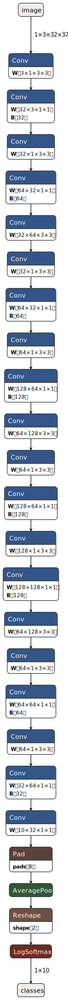
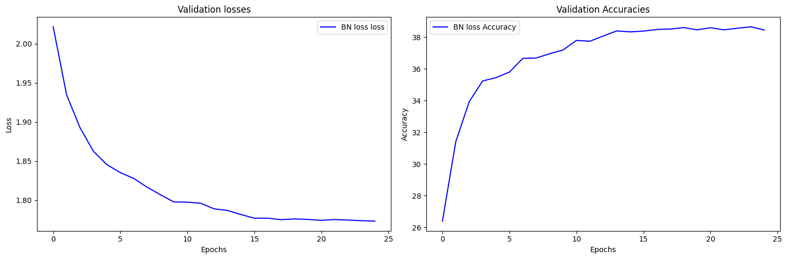
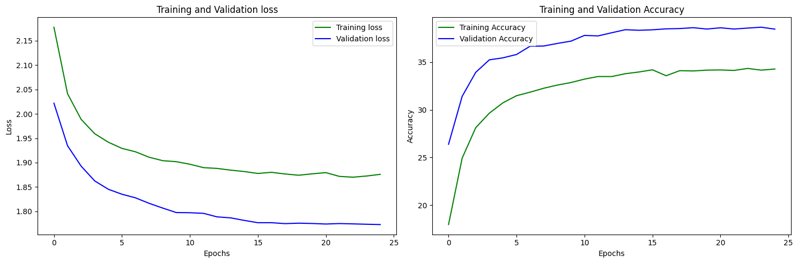
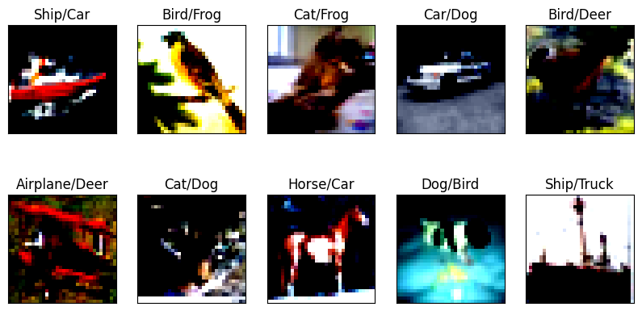
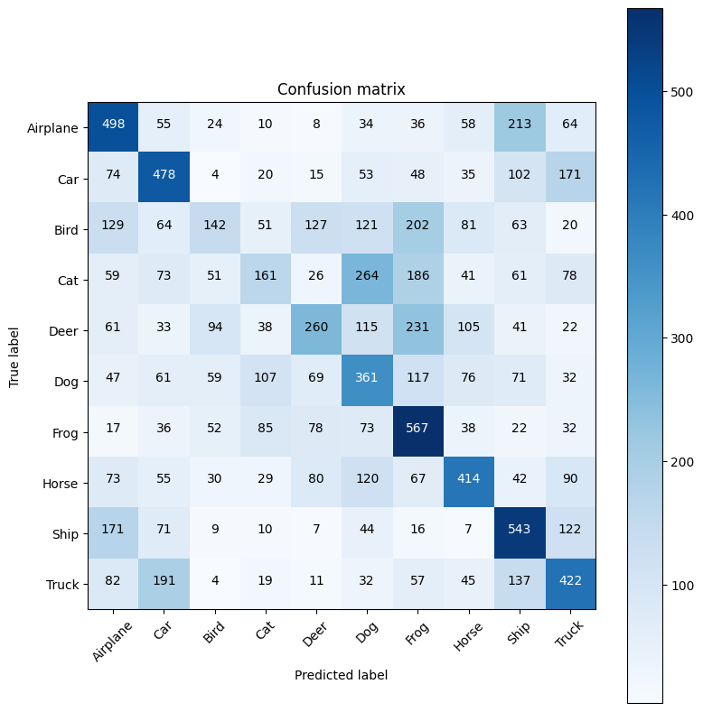

# A model trained on CIFAR using Dilated Convolution and Depthwise Separable Convolution.

A network trained using the CIFAR 10 dataset is built utilizing optimization techniques such as Dilated Convolution, Depthwise Separable Convolution, Dropouts, and Pointwise Convolution.

Total trainable parameters in the modle are **214,651 params**, with a **Reciptive field(RF) of 45** and is trained for **25 epochs** managed to reach an accuracy of just **39% on test set**

**I am seriously seeking someone's assistance to review my code and offer constructive feedback in order to enhance the test accuracy**

[Nootbook Link](./S9.ipynb)

We will be showing the following
1. Network Architecture
2. Parameters And Model Summary
3. Model Performance
4. Training Logs
5. Incorrect Predictions
6. Confusion Metrics

<b>Network Architecture</b>



<b>Parameters And Model Summary</b>

```
----------------------------------------------------------------
Adjusting learning rate of group 0 to 1.0000e-02.
Device: cuda
Epochs: 25
Lr: 0.01
Batch Size: 512
Dropout: 0.1
Momentum: 0.0
----------------------------------------------------------------
Normalization: bn
Skip Connection: False
----------------------------------------------------------------
----------------------------------------------------------------
        Layer (type)               Output Shape         Param #
================================================================
            Conv2d-1            [-1, 3, 32, 32]              27
            Conv2d-2           [-1, 32, 32, 32]              96
              ReLU-3           [-1, 32, 32, 32]               0
       BatchNorm2d-4           [-1, 32, 32, 32]              64
           Dropout-5           [-1, 32, 32, 32]               0
 DWSeparableConv2d-6           [-1, 32, 32, 32]               0
            Conv2d-7           [-1, 32, 32, 32]             288
            Conv2d-8           [-1, 64, 32, 32]           2,048
              ReLU-9           [-1, 64, 32, 32]               0
      BatchNorm2d-10           [-1, 64, 32, 32]             128
          Dropout-11           [-1, 64, 32, 32]               0
DWSeparableConv2d-12           [-1, 64, 32, 32]               0
           Conv2d-13           [-1, 32, 14, 14]          18,432
     DilateConv2d-14           [-1, 32, 14, 14]               0
           Conv2d-15           [-1, 32, 14, 14]             288
           Conv2d-16           [-1, 64, 14, 14]           2,048
             ReLU-17           [-1, 64, 14, 14]               0
      BatchNorm2d-18           [-1, 64, 14, 14]             128
          Dropout-19           [-1, 64, 14, 14]               0
DWSeparableConv2d-20           [-1, 64, 14, 14]               0
           Conv2d-21           [-1, 64, 14, 14]             576
           Conv2d-22          [-1, 128, 14, 14]           8,192
             ReLU-23          [-1, 128, 14, 14]               0
      BatchNorm2d-24          [-1, 128, 14, 14]             256
          Dropout-25          [-1, 128, 14, 14]               0
DWSeparableConv2d-26          [-1, 128, 14, 14]               0
           Conv2d-27             [-1, 64, 6, 6]          73,728
GenericConvLayer2d-28             [-1, 64, 6, 6]               0
           Conv2d-29             [-1, 64, 6, 6]             576
           Conv2d-30            [-1, 128, 6, 6]           8,192
             ReLU-31            [-1, 128, 6, 6]               0
      BatchNorm2d-32            [-1, 128, 6, 6]             256
          Dropout-33            [-1, 128, 6, 6]               0
DWSeparableConv2d-34            [-1, 128, 6, 6]               0
           Conv2d-35            [-1, 128, 6, 6]           1,152
           Conv2d-36            [-1, 128, 6, 6]          16,384
             ReLU-37            [-1, 128, 6, 6]               0
      BatchNorm2d-38            [-1, 128, 6, 6]             256
          Dropout-39            [-1, 128, 6, 6]               0
DWSeparableConv2d-40            [-1, 128, 6, 6]               0
           Conv2d-41             [-1, 64, 2, 2]          73,728
GenericConvLayer2d-42             [-1, 64, 2, 2]               0
           Conv2d-43             [-1, 64, 2, 2]             576
           Conv2d-44             [-1, 64, 2, 2]           4,096
             ReLU-45             [-1, 64, 2, 2]               0
      BatchNorm2d-46             [-1, 64, 2, 2]             128
          Dropout-47             [-1, 64, 2, 2]               0
DWSeparableConv2d-48             [-1, 64, 2, 2]               0
           Conv2d-49             [-1, 64, 2, 2]             576
           Conv2d-50             [-1, 32, 2, 2]           2,048
             ReLU-51             [-1, 32, 2, 2]               0
      BatchNorm2d-52             [-1, 32, 2, 2]              64
          Dropout-53             [-1, 32, 2, 2]               0
DWSeparableConv2d-54             [-1, 32, 2, 2]               0
           Conv2d-55             [-1, 10, 2, 2]             320
GenericConvLayer2d-56             [-1, 10, 2, 2]               0
        AvgPool2d-57             [-1, 10, 1, 1]               0
================================================================
Total params: 214,651
Trainable params: 214,651
Non-trainable params: 0
----------------------------------------------------------------
```

<b>Model Performance</b>





<b>Training Logs</b>

```
----------------------------------------------------------------
Epoch 1
Train: Loss=2.0984 Batch_id=97 Accuracy=17.97: 100%|██████████| 98/98 [00:11<00:00,  8.83it/s]
Test set: Average loss: 2.0218, Accuracy: 2639/10000 (26.39%)

Adjusting learning rate of group 0 to 1.0000e-02.
Epoch 2
Train: Loss=1.9832 Batch_id=97 Accuracy=24.93: 100%|██████████| 98/98 [00:11<00:00,  8.66it/s]
Test set: Average loss: 1.9347, Accuracy: 3141/10000 (31.41%)

Adjusting learning rate of group 0 to 1.0000e-02.
Epoch 3
Train: Loss=2.0276 Batch_id=97 Accuracy=28.13: 100%|██████████| 98/98 [00:11<00:00,  8.71it/s]
Test set: Average loss: 1.8928, Accuracy: 3393/10000 (33.93%)

Adjusting learning rate of group 0 to 1.0000e-02.
Epoch 4
Train: Loss=1.9939 Batch_id=97 Accuracy=29.65: 100%|██████████| 98/98 [00:11<00:00,  8.67it/s]
Test set: Average loss: 1.8625, Accuracy: 3524/10000 (35.24%)

Adjusting learning rate of group 0 to 1.0000e-02.
Epoch 5
Train: Loss=1.8700 Batch_id=97 Accuracy=30.74: 100%|██████████| 98/98 [00:11<00:00,  8.60it/s]
Test set: Average loss: 1.8454, Accuracy: 3545/10000 (35.45%)

Adjusting learning rate of group 0 to 1.0000e-02.
Epoch 6
Train: Loss=1.9706 Batch_id=97 Accuracy=31.48: 100%|██████████| 98/98 [00:11<00:00,  8.47it/s]
Test set: Average loss: 1.8352, Accuracy: 3580/10000 (35.80%)

Adjusting learning rate of group 0 to 1.0000e-02.
Epoch 7
Train: Loss=1.8342 Batch_id=97 Accuracy=31.85: 100%|██████████| 98/98 [00:11<00:00,  8.31it/s]
Test set: Average loss: 1.8278, Accuracy: 3667/10000 (36.67%)

Adjusting learning rate of group 0 to 1.0000e-02.
Epoch 8
Train: Loss=1.9085 Batch_id=97 Accuracy=32.26: 100%|██████████| 98/98 [00:11<00:00,  8.36it/s]
Test set: Average loss: 1.8166, Accuracy: 3669/10000 (36.69%)

Adjusting learning rate of group 0 to 1.0000e-02.
Epoch 9
Train: Loss=1.8895 Batch_id=97 Accuracy=32.59: 100%|██████████| 98/98 [00:11<00:00,  8.18it/s]
Test set: Average loss: 1.8069, Accuracy: 3696/10000 (36.96%)

Adjusting learning rate of group 0 to 1.0000e-02.
Epoch 10
Train: Loss=1.8606 Batch_id=97 Accuracy=32.86: 100%|██████████| 98/98 [00:11<00:00,  8.29it/s]
Test set: Average loss: 1.7977, Accuracy: 3720/10000 (37.20%)

Adjusting learning rate of group 0 to 1.0000e-02.
Epoch 11
Train: Loss=1.9860 Batch_id=97 Accuracy=33.22: 100%|██████████| 98/98 [00:11<00:00,  8.20it/s]
Test set: Average loss: 1.7973, Accuracy: 3780/10000 (37.80%)

Adjusting learning rate of group 0 to 1.0000e-02.
Epoch 12
Train: Loss=1.7894 Batch_id=97 Accuracy=33.49: 100%|██████████| 98/98 [00:11<00:00,  8.29it/s]
Test set: Average loss: 1.7960, Accuracy: 3775/10000 (37.75%)

Adjusting learning rate of group 0 to 1.0000e-02.
Epoch 13
Train: Loss=1.8218 Batch_id=97 Accuracy=33.49: 100%|██████████| 98/98 [00:11<00:00,  8.21it/s]
Test set: Average loss: 1.7888, Accuracy: 3808/10000 (38.08%)

Adjusting learning rate of group 0 to 1.0000e-02.
Epoch 14
Train: Loss=1.9838 Batch_id=97 Accuracy=33.79: 100%|██████████| 98/98 [00:11<00:00,  8.26it/s]
Test set: Average loss: 1.7868, Accuracy: 3840/10000 (38.40%)

Adjusting learning rate of group 0 to 1.0000e-02.
Epoch 15
Train: Loss=1.7986 Batch_id=97 Accuracy=33.97: 100%|██████████| 98/98 [00:11<00:00,  8.21it/s]
Test set: Average loss: 1.7816, Accuracy: 3834/10000 (38.34%)

Adjusting learning rate of group 0 to 1.0000e-03.
Epoch 16
Train: Loss=1.8512 Batch_id=97 Accuracy=34.20: 100%|██████████| 98/98 [00:11<00:00,  8.18it/s]
Test set: Average loss: 1.7769, Accuracy: 3839/10000 (38.39%)

Adjusting learning rate of group 0 to 1.0000e-03.
Epoch 17
Train: Loss=1.9450 Batch_id=97 Accuracy=33.57: 100%|██████████| 98/98 [00:12<00:00,  8.16it/s]
Test set: Average loss: 1.7769, Accuracy: 3849/10000 (38.49%)

Adjusting learning rate of group 0 to 1.0000e-03.
Epoch 18
Train: Loss=1.8944 Batch_id=97 Accuracy=34.10: 100%|██████████| 98/98 [00:11<00:00,  8.27it/s]
Test set: Average loss: 1.7750, Accuracy: 3852/10000 (38.52%)

Adjusting learning rate of group 0 to 1.0000e-03.
Epoch 19
Train: Loss=1.8687 Batch_id=97 Accuracy=34.08: 100%|██████████| 98/98 [00:11<00:00,  8.20it/s]
Test set: Average loss: 1.7759, Accuracy: 3861/10000 (38.61%)

Adjusting learning rate of group 0 to 1.0000e-03.
Epoch 20
Train: Loss=1.8943 Batch_id=97 Accuracy=34.16: 100%|██████████| 98/98 [00:11<00:00,  8.23it/s]
Test set: Average loss: 1.7753, Accuracy: 3847/10000 (38.47%)

Adjusting learning rate of group 0 to 1.0000e-03.
Epoch 21
Train: Loss=1.8629 Batch_id=97 Accuracy=34.18: 100%|██████████| 98/98 [00:11<00:00,  8.26it/s]
Test set: Average loss: 1.7741, Accuracy: 3860/10000 (38.60%)

Adjusting learning rate of group 0 to 1.0000e-03.
Epoch 22
Train: Loss=1.9955 Batch_id=97 Accuracy=34.13: 100%|██████████| 98/98 [00:11<00:00,  8.24it/s]
Test set: Average loss: 1.7751, Accuracy: 3847/10000 (38.47%)

Adjusting learning rate of group 0 to 1.0000e-03.
Epoch 23
Train: Loss=1.7964 Batch_id=97 Accuracy=34.34: 100%|██████████| 98/98 [00:11<00:00,  8.45it/s]
Test set: Average loss: 1.7744, Accuracy: 3857/10000 (38.57%)

Adjusting learning rate of group 0 to 1.0000e-03.
Epoch 24
Train: Loss=1.8508 Batch_id=97 Accuracy=34.16: 100%|██████████| 98/98 [00:10<00:00,  8.91it/s]
Test set: Average loss: 1.7737, Accuracy: 3866/10000 (38.66%)

Adjusting learning rate of group 0 to 1.0000e-03.
Epoch 25
Train: Loss=1.8690 Batch_id=97 Accuracy=34.28: 100%|██████████| 98/98 [00:10<00:00,  8.95it/s]
Test set: Average loss: 1.7731, Accuracy: 3846/10000 (38.46%)

Adjusting learning rate of group 0 to 1.0000e-03.
****************************************************************
```

<b>Incorrect Predictions</b>



<b>Confusion Matrix</b>

